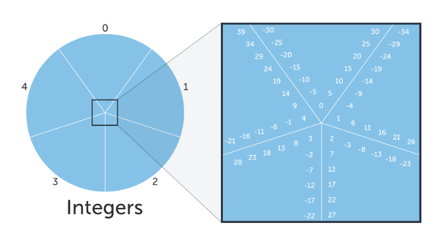

# CERG - Computer Engineering Reference Guide
## Computer Timing
### Latency
* [Berkeley Latency Numbers](https://people.eecs.berkeley.edu/~rcs/research/interactive_latency.html)
  
* [High Scalability Calculations](http://highscalability.com/blog/2011/1/26/google-pro-tip-use-back-of-the-envelope-calculations-to-choo.html)
## Graphics
### Bezier
* [Pomax Bezier](https://people.eecs.berkeley.edu/~rcs/research/interactive_latency.html)
  
### Images
* [Image Kernels](https://blog.usejournal.com/lean-testing-or-why-unit-tests-are-worse-than-you-think-b6500139a009)
  
## Security
### Cryptography
* [Khan Cryptography](https://www.khanacademy.org/computing/computer-science/cryptography)
  
## Testing
### Integration
* [Integration Over Unit](https://blog.usejournal.com/lean-testing-or-why-unit-tests-are-worse-than-you-think-b6500139a009)
  
